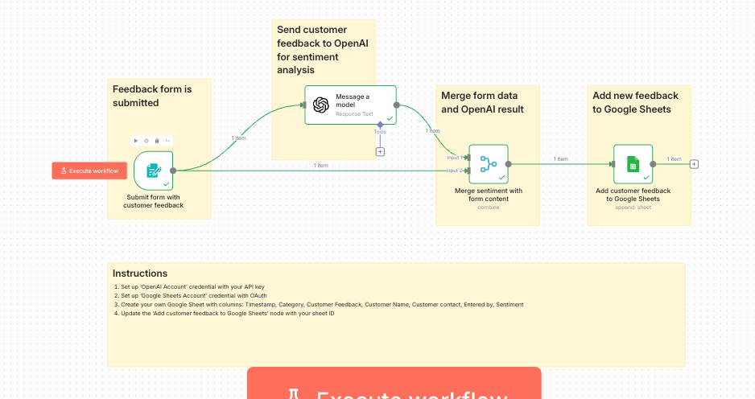
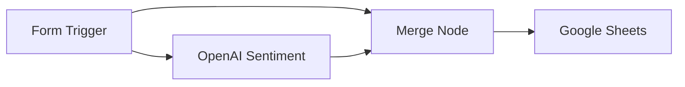

# 01 - AI Customer Feedback Sentiment Analysis

Automatically analyze customer feedback sentiment using OpenAI and store results in Google Sheets.

## Demo

<!-- TODO: Record demo and add GIF -->

## Overview

**Workflow:**
1. Customer submits feedback via n8n Form
2. OpenAI analyzes the sentiment (positive/negative/neutral)
3. Form data + sentiment merged together
4. Results saved to Google Sheets

## Required Credentials

| Credential Name | Type | Purpose |
|-----------------|------|---------|
| `OpenAI Account` | OpenAI API | Sentiment classification |
| `Google Sheets Account` | Google OAuth | Store feedback data |

## Quick Start

1. **Import workflow**: Copy `workflow.json` into n8n
2. **Set up credentials**:
   - Create `OpenAI Account` credential with your API key
   - Create `Google Sheets Account` credential with OAuth
3. **Create Google Sheet** with columns:
   - Timestamp, Category, Customer Feedback, Customer Name, Customer contact, Entered by, Sentiment
4. **Update node**: Replace `YOUR_GOOGLE_SHEET_ID` with your sheet ID
5. **Activate** the workflow

## Testing

1. Access the form URL shown in the Form Trigger node
2. Submit test feedback
3. Check your Google Sheet for the new row with sentiment

## Technologies

- n8n Form Trigger
- OpenAI (GPT-3.5/4)
- Google Sheets API
- Merge Node
