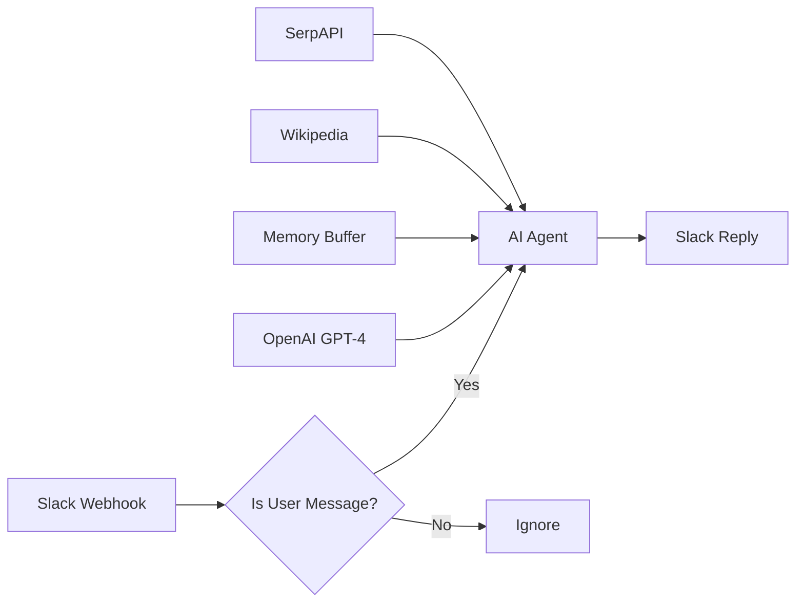

# 02 - Slack AI Chatbot

A conversational AI chatbot for Slack with memory and external tool integration.

## Demo

<!-- TODO: Record demo and add GIF -->

## Overview

**Features:**
- Conversational AI powered by GPT-4
- Memory buffer maintains conversation context
- Wikipedia integration for factual queries
- SerpAPI for web search capabilities
- Filters out bot messages to prevent loops

## Required Credentials

| Credential Name | Type | Purpose |
|-----------------|------|---------|
| `OpenAI Account` | OpenAI API | LLM for conversations |
| `Slack Account` | Slack API | Receive/send messages |
| `SerpAPI Account` | SerpAPI | Web search (optional) |

## Slack App Setup

1. Go to [api.slack.com/apps](https://api.slack.com/apps)
2. Create New App → From scratch
3. Add OAuth Scopes:
   - `chat:write` - Send messages
   - `app_mentions:read` - Read mentions
   - `channels:history` - Read channel history
   - `im:history` - Read DM history
4. Enable Event Subscriptions
5. Subscribe to: `message.channels`, `message.im`
6. Set Request URL to your n8n webhook URL
7. Install to workspace

## Quick Start

1. **Import workflow** into n8n
2. **Set up Slack App** (see above)
3. **Create credentials**:
   - `OpenAI Account`
   - `Slack Account`
   - `SerpAPI Account` (optional)
4. **Update webhook path** if needed
5. **Activate** the workflow

## Testing

1. Open Slack workspace
2. Send a DM to your bot
3. Bot should respond with AI-generated message

## Technologies

- n8n Webhook
- LangChain Agent
- OpenAI GPT-4
- Window Buffer Memory
- Wikipedia Tool
- SerpAPI Tool
- Slack API
