# 03 - WordPress AI Chatbot with Supabase

A RAG-based AI chatbot for WordPress websites using vector embeddings stored in Supabase.

## Demo


<!-- TODO: Record demo and add GIF -->

## Overview

This workflow consists of 3 sub-workflows:

```mermaid
graph TD
    subgraph "Workflow 1: Initial Embedding"
        A[WordPress Posts/Pages] --> B[HTML to Markdown]
        B --> C[Token Splitter]
        C --> D[OpenAI Embeddings]
        D --> E[Supabase Vector Store]
    end
    
    subgraph "Workflow 2: Upsert (Scheduled)"
        F[Schedule Trigger] --> G[Get Modified Content]
        G --> H[Update Vector Store]
    end
    
    subgraph "Workflow 3: Chat Interface"
        I[User Message] --> J[Vector Search]
        J --> K[AI Agent + Context]
        K --> L[Response]
    end
```



**Features:**
- Automatically embeds WordPress content into vector store
- Incremental updates for new/modified content
- RAG-based chat with source citations
- Postgres chat memory for conversation history

## Required Credentials

| Credential Name | Type | Purpose |
|-----------------|------|---------|
| `OpenAI Account` | OpenAI API | Embeddings & Chat |
| `Supabase Account` | Supabase | Vector store & DB |
| `WordPress Account` | WordPress API | Fetch content |
| `Postgres Account` | PostgreSQL | Chat memory |

## Database Setup

Create these tables in Supabase:

```sql
-- Vector store table (created by workflow)
-- n8n_website_embedding_histories table for tracking

CREATE TABLE n8n_website_embedding_histories (
  id TEXT PRIMARY KEY,
  created_at TIMESTAMP DEFAULT NOW()
);

CREATE TABLE website_chat_histories (
  id SERIAL PRIMARY KEY,
  session_id TEXT,
  message JSONB,
  created_at TIMESTAMP DEFAULT NOW()
);
```

## Quick Start

1. **Import workflow** into n8n
2. **Set up Supabase** project with pgvector extension
3. **Configure WordPress** API credentials
4. **Run Workflow 1** to create initial embeddings
5. **Activate Workflow 2** for auto-updates
6. **Enable Workflow 3** for chat interface

## Technologies

- WordPress REST API
- OpenAI text-embedding-3-small
- Supabase Vector Store
- LangChain Document Loaders
- Token Splitter
- Postgres Chat Memory
