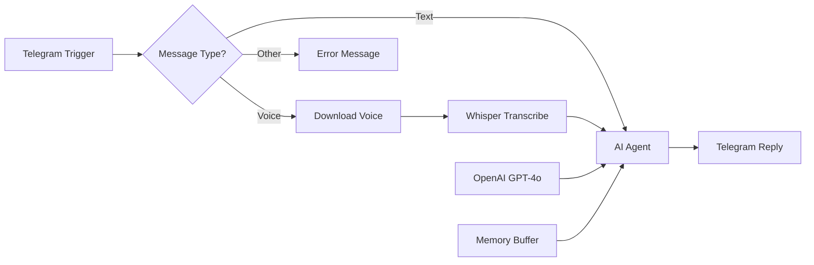

# 04 - Telegram AI Assistant

A Telegram chatbot supporting both voice and text messages with AI-powered responses.

## Demo

<!-- TODO: Record demo and add GIF -->

## Overview

**Features:**
- Supports text messages
- Voice message transcription with Whisper
- Conversation memory by chat ID
- HTML-formatted responses
- Typing indicator while processing

## Required Credentials

| Credential Name | Type | Purpose |
|-----------------|------|---------|
| `OpenAI Account` | OpenAI API | Chat & Transcription |
| `Telegram Account` | Telegram API | Bot messaging |

## Telegram Bot Setup

1. Open Telegram, find [@BotFather](https://t.me/BotFather)
2. Send `/newbot` and follow the prompts
3. Copy the bot token (format: `123456789:ABC...`)
4. In n8n, create `Telegram Account` credential
5. Set webhook URL to your n8n instance

## Quick Start

1. **Import workflow** into n8n
2. **Create Telegram bot** via BotFather
3. **Set up credentials**:
   - `OpenAI Account`
   - `Telegram Account`
4. **Activate** the workflow
5. **Message your bot** to test

## Testing

1. Find your bot on Telegram
2. Send `/start` or any text message
3. Send a voice message
4. Bot responds with AI-generated reply

## Technologies

- Telegram Bot API
- OpenAI GPT-4o
- OpenAI Whisper (voice transcription)
- Window Buffer Memory
- Switch Node (content routing)
