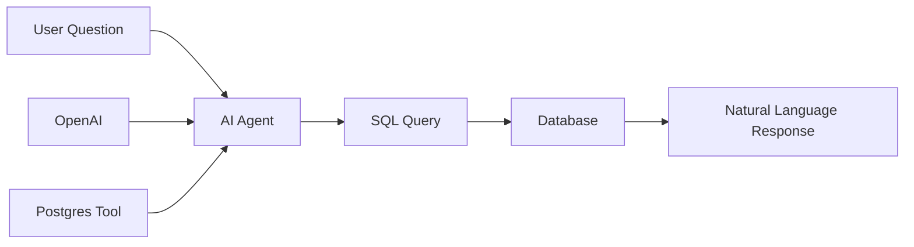

# 05 - PostgreSQL AI Agent

Chat with your PostgreSQL/Supabase database using natural language queries.

## Demo

## Overview

**Features:**
- Natural language to SQL conversion
- Automatic schema discovery
- JSON data extraction and summarization
- Conversational interface

## Required Credentials

| Credential Name | Type | Purpose |
|-----------------|------|---------|
| `OpenAI Account` | OpenAI API | Query generation |
| `Postgres Account` | PostgreSQL | Database access |

## Quick Start

1. **Import workflow** into n8n
2. **Set up credentials**:
   - `OpenAI Account`
   - `Postgres Account`
3. **Activate** the workflow
4. **Ask questions** like:
   - "What tables are available?"
   - "Show me top 10 customers by revenue"

## Technologies

- LangChain AI Agent
- OpenAI GPT-4
- PostgreSQL Tool
- Supabase (optional)
