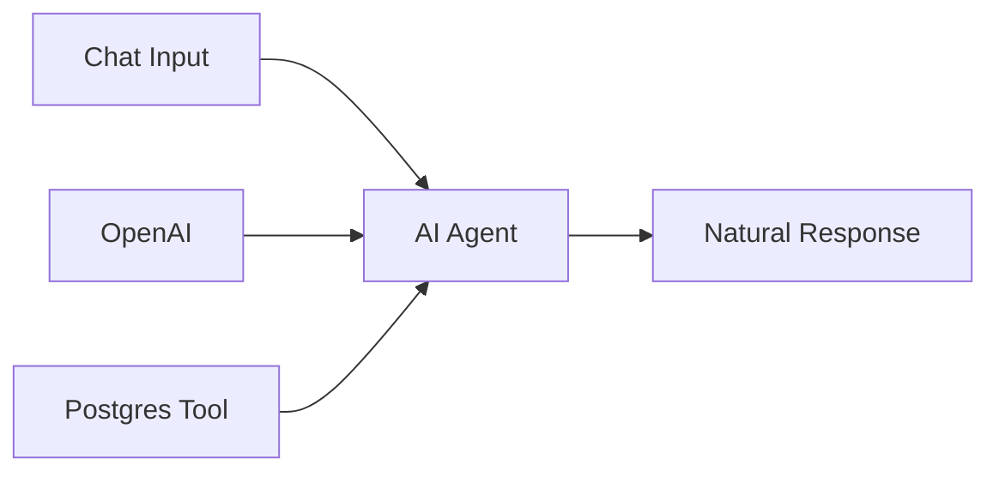

# 06 - Database AI Chat

A conversational interface for querying PostgreSQL databases with natural language.

## Demo

## Overview

**Features:**
- User-friendly chat interface
- Database schema exploration
- Complex query generation
- Natural language responses

## Required Credentials

| Credential Name | Type | Purpose |
|-----------------|------|---------|
| `OpenAI Account` | OpenAI API | LLM processing |
| `Postgres Account` | PostgreSQL | Database queries |

## Quick Start

1. **Import workflow** into n8n
2. **Configure credentials**
3. **Activate** and start chatting

## Example Queries

- "Which tables are available?"
- "What are the top 5 products by sales?"
- "Show customer distribution by country"

## Technologies

- OpenAI GPT-4
- PostgreSQL
- LangChain Agent
