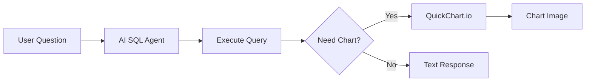

# 07 - SQL Agent with Chart Visualization

AI-powered SQL agent that automatically generates charts from query results.

## Demo

## Overview

**Features:**
- Natural language to SQL
- Automatic chart generation
- Smart chart type selection
- QuickChart.io integration

## Required Credentials

| Credential Name | Type | Purpose |
|-----------------|------|---------|
| `OpenAI Account` | OpenAI API | SQL & chart generation |
| `Postgres Account` | PostgreSQL | Database queries |

## Quick Start

1. **Import workflow** into n8n
2. **Configure credentials**
3. **Activate** and ask questions
4. Charts auto-generated when appropriate

## Example Queries

- "Show monthly sales trend"
- "Compare revenue by region"
- "Top 10 products pie chart"

## Technologies

- OpenAI Structured Output
- QuickChart.io API
- PostgreSQL
- LangChain Agent
