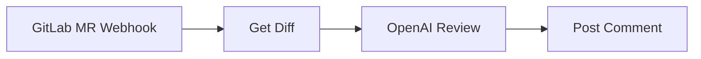

# 08 - GitLab MR Auto Code Review

Automated code review for GitLab Merge Requests using ChatGPT.

## Demo

## Overview

**Features:**
- Automated code analysis
- Detailed review comments
- Posted directly to MR discussion
- Customizable review prompts

## Required Credentials

| Credential Name | Type | Purpose |
|-----------------|------|---------|
| `OpenAI Account` | OpenAI API | Code analysis |
| `GitLab Account` | GitLab API | MR access |

## GitLab Setup

1. Go to **Settings** → **Access Tokens**
2. Create token with `api` scope
3. In n8n, create `GitLab Account` credential
4. Set up webhook in GitLab project

## Quick Start

1. **Import workflow** into n8n
2. **Configure credentials**
3. **Set up GitLab webhook** for MR events
4. **Activate** workflow

## Technologies

- GitLab API
- OpenAI GPT-4
- Webhook Trigger
