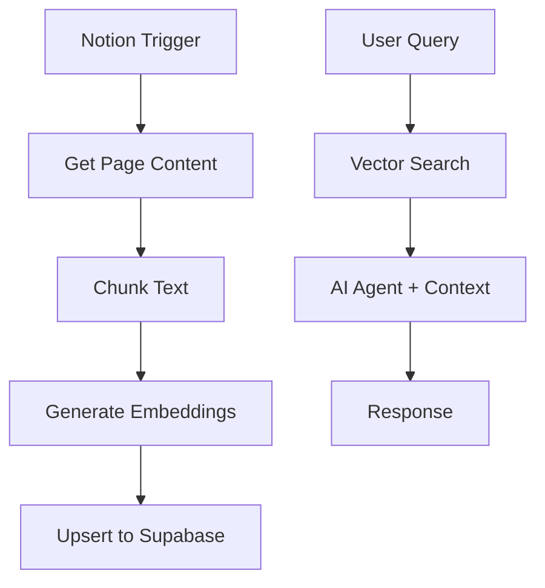

# 09 - Notion to Vector Store (RAG)

Automatically sync Notion knowledge base to Supabase vector store for AI-powered search.

## Demo

## Overview

**Features:**
- Auto-sync Notion content
- Incremental updates
- Vector similarity search
- RAG-based Q&A

## Required Credentials

| Credential Name | Type | Purpose |
|-----------------|------|---------|
| `OpenAI Account` | OpenAI API | Embeddings & Chat |
| `Supabase Account` | Supabase | Vector store |
| `Notion Account` | Notion API | Content source |

## Quick Start

1. **Set up Supabase** with pgvector extension
2. **Connect Notion** integration
3. **Import workflow** into n8n
4. **Configure credentials**
5. **Run initial sync**

## Technologies

- Notion API
- OpenAI Embeddings
- Supabase Vector Store
- LangChain RAG
