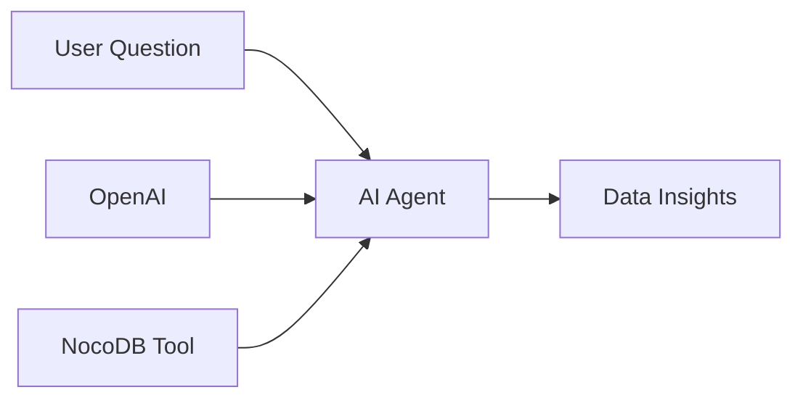

# 10 - NocoDB Data Analyst Agent

AI agent for exploring and analyzing NocoDB spreadsheet data.

## Demo

## Overview

**Features:**
- Schema discovery
- Natural language queries
- Data analysis assistance
- Spreadsheet exploration

## Required Credentials

| Credential Name | Type | Purpose |
|-----------------|------|---------|
| `OpenAI Account` | OpenAI API | AI analysis |
| `NocoDB Account` | NocoDB API | Data access |

## Quick Start

1. **Set up NocoDB** instance
2. **Create API token** in NocoDB
3. **Import workflow** into n8n
4. **Configure credentials**
5. **Start analyzing** your data

## Example Queries

- "What columns does this table have?"
- "Show me the data distribution"
- "Find records matching criteria X"

## Technologies

- NocoDB API
- OpenAI GPT-4
- LangChain Agent
